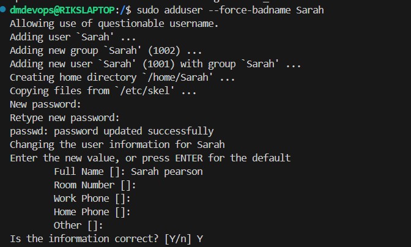
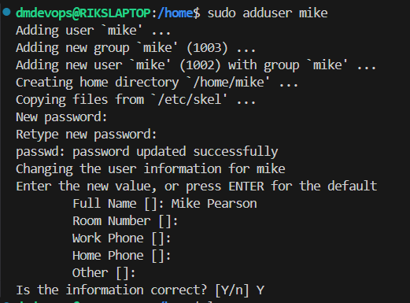
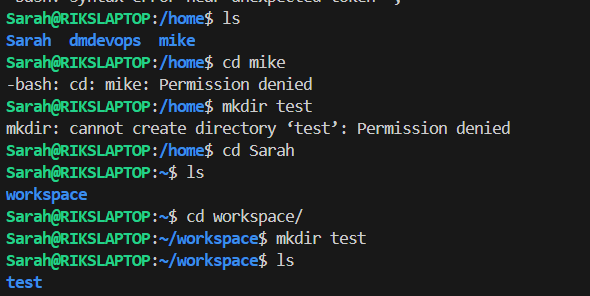
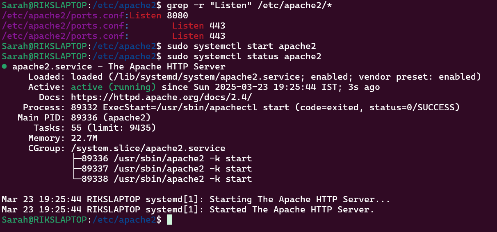
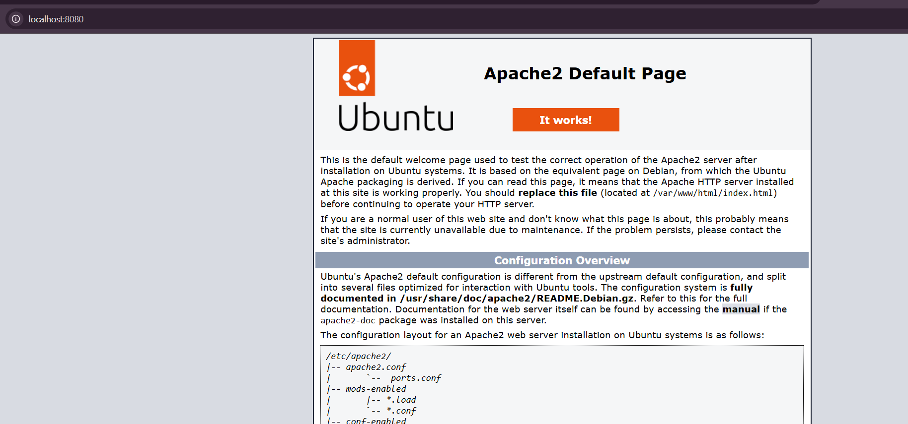

____
# Task 1: System Monitoring Setup

**Objective**: Configure a monitoring system to ensure the development environment’s health, performance, and capacity planning.

-----
**Requirements:**
+ Install and configure monitoring tools (htop or nmon) to monitor CPU, memory, and process usage.
+ Set up disk usage monitoring to track storage availability using df and du.
+ Implement process monitoring to identify resource-intensive applications.
+ Create a basic reporting structure (e.g., save outputs to a log file for review).
----
## Detailed steps
1. install htop and nmon 

    ```
    sudo apt update
    sudo apt install htop
    sudo apt install nmon
    ```
2. disk usage monitoring to track storage 
    - **df** 
        - The "disk free" command is command-line tool . It tells you the total disk size, space used, space available, usage percentage, and what partition the disk is mounted on. 
        - ``df -h`` - gives all information on human readable format
        - `` df -h {mount_location}`` - gives all information on human readable format on mount location
        - Example-
           ```
            dmdevops@RIKSLAPTOP:~/codebase/envSetup$ df -h /home
            Filesystem      Size  Used Avail Use% Mounted on
            /dev/sdc       1007G  2.5G  954G   1% /
            ```
    - **du**
        - The "disk usage" It runs at the object level and only reports on the specified stats at the time of execution. 
        - ```du -sh {mount_location}``` sh flags to give a human-readable summary of a specified object (the directory and all subdirectories.
        - Example -
            ```
            dmdevops@RIKSLAPTOP:~/codebase/envSetup$ du -sh /home
            194M    /home
            ```
3. Implement process monitoring to identify resource-intensive applications.
    - Create a script and provide execute rights to the script 
        ```
        touch system_monitor.sh
        chmod +x system_monitor.sh
        ```
    - Run the script and provide an argument to run for multiple mount points. using sudo 
        ```
        dmdevops@RIKSLAPTOP:~/codebase/envSetup/monitor$ sudo ./system_monitor.sh "/home/dmdevops/codebase" "/home/dmdevops/codebase/envSetup/monitor"
        Starting script...
        --- CPU and Memory Usage --- started
        --- CPU and Memory Usage  --- completed
        --- Disk Usage analysis --- started
        --- Disk Usage analysis --- completed
        --- Resource-Intensive Processes analysis --- started
        --- Resource-Intensive Processes analysis --- completed
        ---starting another iteration press Ctrl+C to terminate the script
        Starting script...
        ^C
        ```
   
4. Centralised log files are configurable in bash script. in each run older logs file are getting backed up 

    ```
    dmdevops@RIKSLAPTOP:/var/log/system_monitor$ ls
    system_monitor_RIKSLAPTOP.log
    dmdevops@RIKSLAPTOP:/var/log/system_monitor$ ls
    system_monitor_RIKSLAPTOP.log  system_monitor_RIKSLAPTOP_2025-03-18_02-48-27.log.old
    dmdevops@RIKSLAPTOP:/var/log/system_monitor$ ls
    system_monitor_RIKSLAPTOP.log  system_monitor_RIKSLAPTOP_2025-03-18_02-48-27.log.old  system_monitor_RIKSLAPTOP_2025-03-18_02-50-57.log.old   
    ```
____
# Task 2: User Management and Access Control

**Objective**: Set up user accounts and configure secure access controls for the new developers.

**Scenario**:
Two new developers, Sarah and Mike, require system access.Each developer needs an isolated working directory to maintain security and confidentiality.
Security policies must ensure proper password management and access restrictions.

**Requirements**:
+  Create user accounts for Sarah and Mike with secure passwords.
+  Set up dedicated directories: 
    - Sarah: /home/Sarah/workspace
    - Mike: /home/mike/workspace
+  Ensure only the respective users can access their directories using appropriate permissions.
+  Implement a password policy to enforce expiration and complexity (e.g., passwords expire every 30 days).
-------
## Detailed steps

1. Created Users 

    | User Creation                               | Description |
    | -------------------------------------------:| -----------:|
    | ```sudo adduser --force-badname Sarah```    |  |
    | ```sudo adduser mike```                     |  |

    ```
    dmdevops@RIKSLAPTOP:/home$ ls
    Sarah  dmdevops  mike
    ```
2. Provide access to indivisual users to thier own workspace and set up directory
    ```
    sudo mkdir -p /home/Sarah/workspace
    sudo chown Sarah:Sarah /home/Sarah/workspace
    sudo chmod 700 /home/Sarah/workspace

    ```
    ```
    sudo mkdir -p /home/mike/workspace
    sudo chown mike:mike /home/mike/workspace
    sudo chmod 700 /home/mike/workspace
    
    ```
3. Ensure only the respective users can access their directories using appropriate permissions.

    - **Testing**
        - login with Sarah ```su - Sarah```
        - commands like ls and others are woking 
        - Sarah tried to access the mike folder but unable to acess mike or other workspace. Also she won't be able to view or create any folder except  ***/home/Sarah/workspace***
            - 
            - 
        - tested same with user mike and got similar results
4. Implementing Password Policy (Password Expiration and Complexity)

    - **Configure Password Expiration:**

        ```bash
        sudo chage -M 30 Sarah  # Set maximum password age to 30 days for Sarah
        sudo chage -M 30 mike  # Set maximum password age to 30 days for Mike
         ```
    -   **Install `libpam-pwquality` (if not already installed):**

        ```
        sudo apt update
        sudo apt install libpam-pwquality
        ```
    -    Edit the PAM configuration file for common password changes:
        ```sudo nano /etc/pam.d/common-password```

    -   Find the line that looks like this (it may have a different number of arguments):
        ```
        password required pam_unix.so ...
        ```

    Replace it with the following:

    ```
    password required pam_unix.so obscure sha512 shadow nullok
    password requisite pam_pwquality.so retry=3 minlen=8 ucredit=-1 lcredit=-1 dcredit=-1 ocredit=-1
    password required pam_deny.so
    ```

    **Explanation of `pam_pwquality.so` options:**

    *   `retry=3`:  The user will be allowed 3 attempts to enter a valid password.
    *   `minlen=8`:  Minimum password length of 8 characters.
    *   `ucredit=-1`: Requires at least 1 uppercase letter.
    *   `lcredit=-1`: Requires at least 1 lowercase letter.
    *   `dcredit=-1`: Requires at least 1 digit.
    *   `ocredit=-1`: Requires at least 1 special character (e.g., punctuation).
    *   `obscure`: Try to avoid common passwords (dictionary words).

    Save the file and exit.

-   **Apply password policy for user creation:**
    - Edit the PAM configuration file for user creation:```sudo nano /etc/pam.d/systemd-useradd ```
    - Add the following line to the end of the file:
        ```
        password requisite pam_pwquality.so retry=3 minlen=8 ucredit=-1 lcredit=-1 dcredit=-1 ocredit=-1
        ```
    - Save the file and exit.
- **Testing**
    - set the Last Password Change Date for mike more than 30 days
    ```
    dmdevops@RIKSLAPTOP:~/codebase/envSetup$ sudo chage -d 2023-01-01 mike
    [sudo] password for dmdevops:
    ```
    ```
    dmdevops@RIKSLAPTOP:~/codebase/envSetup$ su - mike 
    Password: 
    You are required to change your password immediately (password expired).
    ```
- revert the date to today again and was able to log in with mike 
    ```
    sudo chage -d $(date +%Y-%m-%d) mike
    ```
___
# Task 3: Backup Configuration for Web Servers

**Objective**: 
    Set up user accounts and configure secure access controls for the new developers.

**Scenario**:
Sarah is responsible for managing an Apache web server.
Mike is responsible for managing a Nginx web server. 
Both servers require regular backups to a secure location for disaster recovery.

**Requirements**:
+ Sarah and Mike need to automate backups for their respective web server configurations and document roots: 
    - Sarah: Backup the Apache configuration (/etc/httpd/) and document root (/var/www/html/).
    - Mike: Backup the Nginx configuration (/etc/nginx/) and document root (/usr/share/nginx/html/).
+  Schedule the backups to run every Tuesday at 12:00 AM using cron jobs. 
    - Sarah: /home/Sarah/workspace
    - Mike: /home/mike/workspace
+  Save the backups as compressed files in /backups/ with filenames including the server name and date (e.g., apache_backup_YYYY-MM-DD.tar.gz).
+  Verify the backup integrity after each run by listing the contents of the compressed file.
-------
## Detailed steps -TO DO

1. Install Apache for Sarah and Ngnix for mike. 
    - login with mike and install Nginx 
        ```
        sudo apt update
        sudo apt install nginx
        ```
    - login with Sarah and install Apache
        ```
        sudo apt update
        sudo apt install apache2 
        ``` 
        - Sarah can now modify Apache's configuration files in /etc/apache2/. She has the necessary permissions to modify files in /var/www/html/  verfied the same using ```ls -l ```
        - modify ```ports.conf``` to 8080 ```Listen```
        - ```sudo systemctl restart apache2``` - Restart apache2 
        - ```sudo systemctl start apache2``` - start the apache2
        - ```sudo systemctl status apache2 ``` - Status to check 
            

            
       

3. Create a central location for the Logging location for apache and Nginx 
    - Create a group adm 
    - add mike and Sarah access to adm 
    - Create backup folder and provide access 
    ```
    sudo mkdir -p /backups
    sudo chown $USER:$USER /backups  # Give current user ownership
    sudo chgrp adm /backups
    ```

4. Create a script to create backup of files 
    - Apache 
    - ngnix 
5. Verify the integrrity of files 


